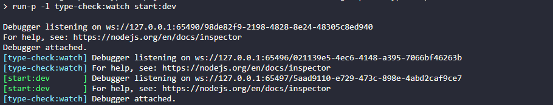

# Scaffolding Express Typescript

## Steps

- Run install

```bash
npm install
```

- Create `.env` file with same `.env.example` value.

- Run development start:

```bash
npm start
```

- Run debug start (Attach mode):

```bash
npm run start:debug
```

- And run .vscode/launch.json (Debug Attach)

# Debugging state

Since VS Code v1.47, it enables a new debugging feature, [New JavaScript Debugger](https://code.visualstudio.com/updates/v1_47#_debugging) as default.

This new debugger works with no configuration on this way:


And run command:

```bash
npm start
```

- It runs the command with auto attached debugger



- But it stops on transpiled code break points when we are debugging:


- We still can use previous debugging if we use `Debug Attach` command defined in .vscode/launch.json, but we need to disable the `New JavaScript Debugger` in settings:


- And now, we can run `npm run start:debug` and `Debug Attach` command defined in .vscode/launch.json:


