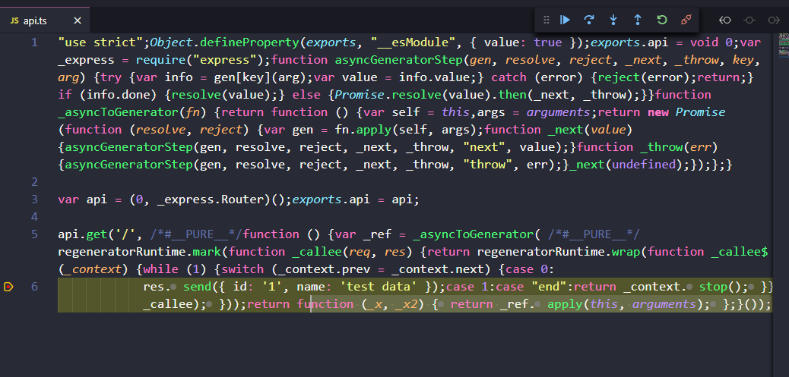
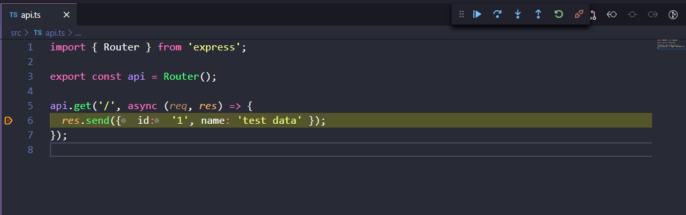

# Scaffolding Express Typescript

[🇪🇸 Versión Español](./README_es.md)

## Steps

- Run install

```bash
npm install
```

- Create `.env` file with same `.env.example` value.

- Run development start:

```bash
npm start
```

- Run debug start (Attach mode):

```bash
npm run start:debug
```

- And run .vscode/launch.json (Debug Attach)

# Adding CORS support

Cross-Origin Resource Sharing (CORS) is a W3C specification and mechanism that you can use to request restricted resources from a domain outside the current domain. In other words, CORS is a technique for consuming an API served from an origin different than yours ([more information](https://www.freecodecamp.org/news/the-terrible-performance-cost-of-cors-api-on-the-single-page-application-spa-6fcf71e50147/)).

If your api is going to be consumed by client code running web applications under different domains, you may need to enable
CORS access on your express server.

[More information about CORS](https://developer.mozilla.org/en-US/docs/Web/HTTP/CORS)

How to configure CORS in express:

First install the following package:

```bash
npm install cors -P
```

Then install the typings for this package:

```bash
npm install @types/cors -D
```

_/src/app.ts_

```diff
import { createApp } from './express.server';
+ import cors from 'cors';
import { envConstants } from './env.constants';
import { api } from './api';

const app = createApp();

+ // Warning: narrow down your CORS allowed origins to the web application domains that
+ // are allowed to access this application.
+ // check the methods and origin properties in the CorsOptions
+ const options: cors.CorsOptions = {
+  allowedHeaders: [
+    'Origin',
+    'X-Requested-With',
+    'Content-Type',
+    'Accept',
+    'X-Access-Token',
+  ],
+  credentials: true,
+  // IMPORTANT YOU MAY LIMIT THE ALLOWED VERBS TO FOR INSTANCE ONLY GET
+  methods: 'GET,HEAD,OPTIONS,PUT,PATCH,POST,DELETE',
+  // IMPORTANT LIMIT THIS HERE TO YOUR CLIENT APPS DOMAINS
+  origin: '*',
+  preflightContinue: false,
+ };
+
+ app.use(cors(options));

app.use('/api', api);

app.listen(envConstants.PORT, () => {
  console.log(`Server ready at http://localhost:${envConstants.PORT}/api`);
});
```

# Debugging on VS Code

Since VSCode v1.47, a new [New JavaScript Debugger](https://code.visualstudio.com/updates/v1_47#_debugging) feature has been enabled.

This new debugger works with zero config:


And just running the command `npm start` it will let us attach to the process and debug:

```bash
npm start
```

- It runs the command with auto attached debugger


- But it doesn't behave well on TypeScript projects yet. It will stop on transpiled code instead of original TS files:



- We still can use previous debugging if we use `Debug Attach` command defined in .vscode/launch.json, but we need to disable the `New JavaScript Debugger` in settings:


- And now, we can run `npm run start:debug` and `Debug Attach` command defined in .vscode/launch.json:



This is something that has been fixed in a nightly build and likely to be released in the near future, [more information](https://github.com/microsoft/vscode/issues/103048)

# Adding testing configuration for Jest

First and foremost, the following packages should be installed:

```bash
npm install jest ts-jest @types/jest -D
```

Then, the following scripts should be added to the package.json file in order to execute tests (the second one will be watching for changes):

package.json

```js
"test": "cross-env NODE_ENV=test jest -c ./config/test/jest.js --verbose",
"test:watch": "npm run test -- --watchAll -i --no-cache",
```

Next, we will create a new folder called 'config' within the root level of our project (be aware not to put it within src folder). Inside this new folder we will add a new one called 'test', in which we will create two new files: 'jest.ts' and 'setup.js'. So, both files should share the same common path: config/test

Now we can open this 'jest.js' file that we have just created and paste inside the following piece of code:

config/test/jest.js

```js
module.exports = {
  rootDir: '../../',
  preset: 'ts-jest',
  restoreMocks: true,
  setupFiles: ['<rootDir>/config/test/setup.js'],
  modulePathIgnorePatterns: ['node_modules', '<rootDir>/dist/'],
  testEnvironment: 'node',
  moduleDirectories: ['<rootDir>/src', 'node_modules'],
};
```

We are not going to work in the 'setup.js' file for the moment, so we can leave it empty. This file will be useful according to the configuration of our project. In this example, we have no business with it.

If we want to check that everything works fine, we can create a new spec file in the following path and paste inside the next code lines:

src/example.test.spec.ts

```js
describe('example test spec', () => {
  it('should pass dummy condition', () => {
    const dummy = true;
    expect(dummy).toEqual(true);
  });
});
```

Finally, we can execute both scripts added to the package.json file and see if everthing works fine. We can also change the value of the 'dummy' variable inside our example spec file using different boolean values to see if the results of the tests are different and so our tests are working.

The following script will run tests globally just once:

```bash
npm run test
```

This script will be waiting for changes in our code and will run tests globally any time we save:

```bash
npm run test:watch
```

We can also run tests for only one file using both previous scripts and the name of the file we want to check:

```bash
npm run test:watch example-test-spec.ts
```
