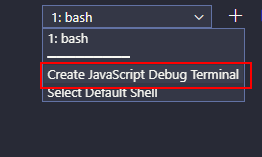
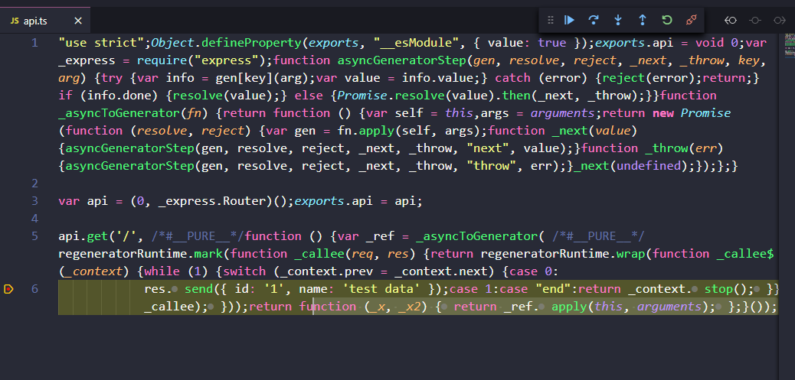
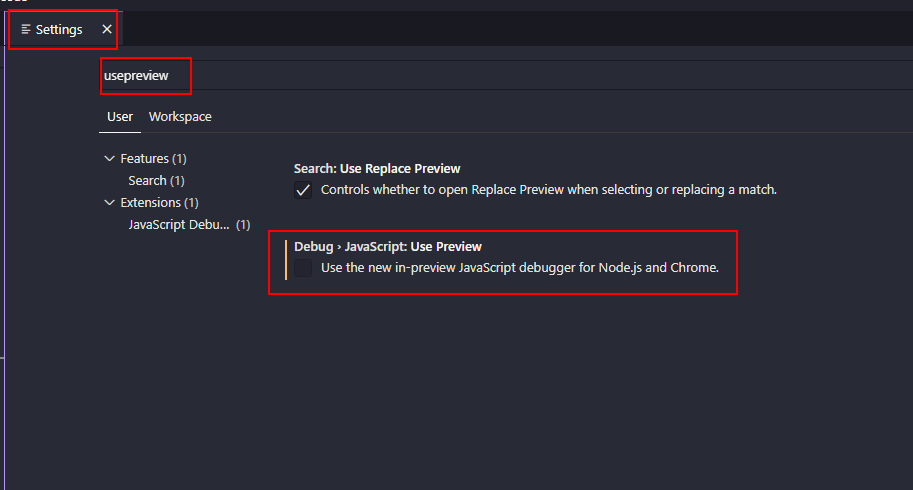

# Scaffolding Express Typescript

[🇬🇧 English version](./README.md)

## Passos

- Ejecutar en consola install

```bash
npm install
```

- Crear el archivo `.env` con el mismo contenido de `.env.example`.

- Ejecutar en modo de desarrollo (development):

```bash
npm start
```

- Ejecutar en modo debug:

```bash
npm run start:debug
```

- Y ejecutar `.vscode/launch.json`

# Añadir soporte CORS

Cross-Origin Resource Sharing (CORS) es una especificación de W3C y un mecanismo dónde puedes restringir las peticiones desde un dominio exterior al dominio de origen. En otras palabras. CORS es una técnica para consumir API servidas desde un origen diferente al que se ecuentra originalmente ([más información](https://www.freecodecamp.org/news/the-terrible-performance-cost-of-cors-api-on-the-single-page-application-spa-6fcf71e50147/)).

Si la API va a ser consimida por código cliente que ejecuta aplicaciones web bajo diferentes dominios, se necesita actiavar el acceso CORS en el servidor express.

[Más informaci´ón sobre CORS](https://developer.mozilla.org/en-US/docs/Web/HTTP/CORS)

Cómo configurar CORS en express:

Primero instala el siguiente paquete

```bash
npm install cors -P
```

Instala el tipado para el paquete.

```bash
npm install @types/cors -D
```

_/src/app.ts_

```diff
import { createApp } from './express.server';
+ import cors from 'cors';
import { envConstants } from './env.constants';
import { api } from './api';

const app = createApp();

+ // Warning: narrow down your CORS allowed origins to the web application domains that
+ // are allowed to access this application.
+ // check the methods and origin properties in the CorsOptions
+ const options: cors.CorsOptions = {
+  allowedHeaders: [
+    'Origin',
+    'X-Requested-With',
+    'Content-Type',
+    'Accept',
+    'X-Access-Token',
+  ],
+  credentials: true,
+  // IMPORTANT YOU MAY LIMIT THE ALLOWED VERBS TO FOR INSTANCE ONLY GET
+  methods: 'GET,HEAD,OPTIONS,PUT,PATCH,POST,DELETE',
+  // IMPORTANT LIMIT THIS HERE TO YOUR CLIENT APPS DOMAINS
+  origin: '*',
+  preflightContinue: false,
+ };
+
+ app.use(cors(options));

app.use('/api', api);

app.listen(envConstants.PORT, () => {
  console.log(`Server ready at http://localhost:${envConstants.PORT}/api`);
});
```


# Debugging en VS Code

Desde la versión 1.47 de VSCode [JavaScript Debugger](https://code.visualstudio.com/updates/v1_47#_debugging) fue activada una nueva mejora.

Este nuevo debugger funciona con cero configuración:



Y con sólo ejecutar el comando `npm start` nos permitirá conectarnos al proceso y depurar:

```bash
npm start
```

- Ejecuta el comando con un depurador automático...


- Pero aún no se comporta bien en los proyectos de TypeScript. Se detendrá en el código transpilado en lugar de los archivos originales de TS:



- Todavía podemos usar la depuración previa si usamos el comando `Debug Attach` definido en .vscode/launch.json, pero necesitamos deshabilitar el `New JavaScript Debugger` en la configuración:



- Y ahora podemos ejecutar `npm run start:debug` y `Debug Attach` commando definido en .vscode/launch.json:


Esto es algo que ha sido arreglado en una "nightly build" y es posible que se libere en un futuro próximo, [más información](https://github.com/microsoft/vscode/issues/103048)
